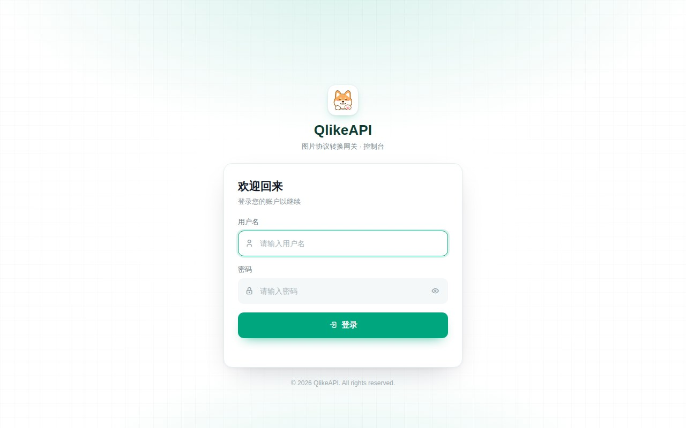
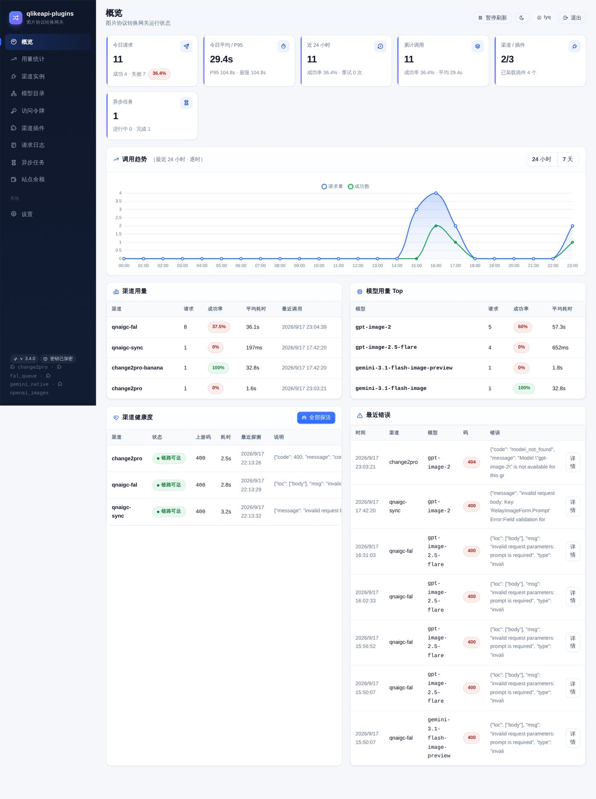
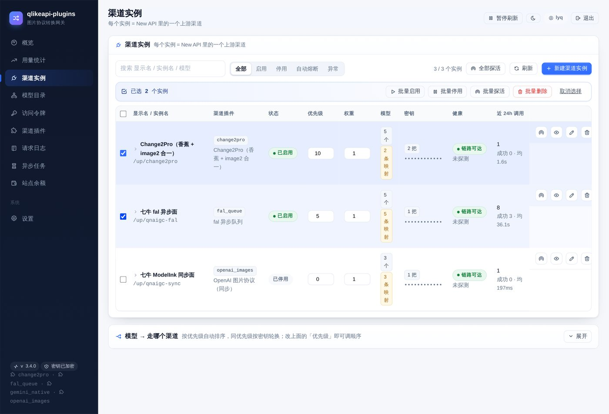
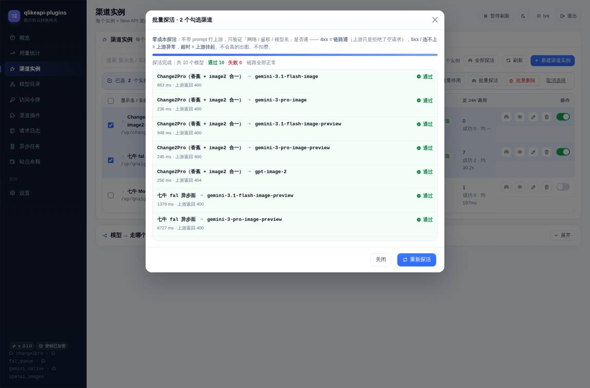
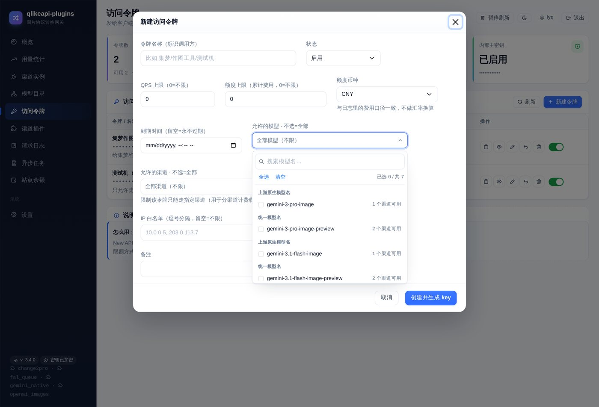
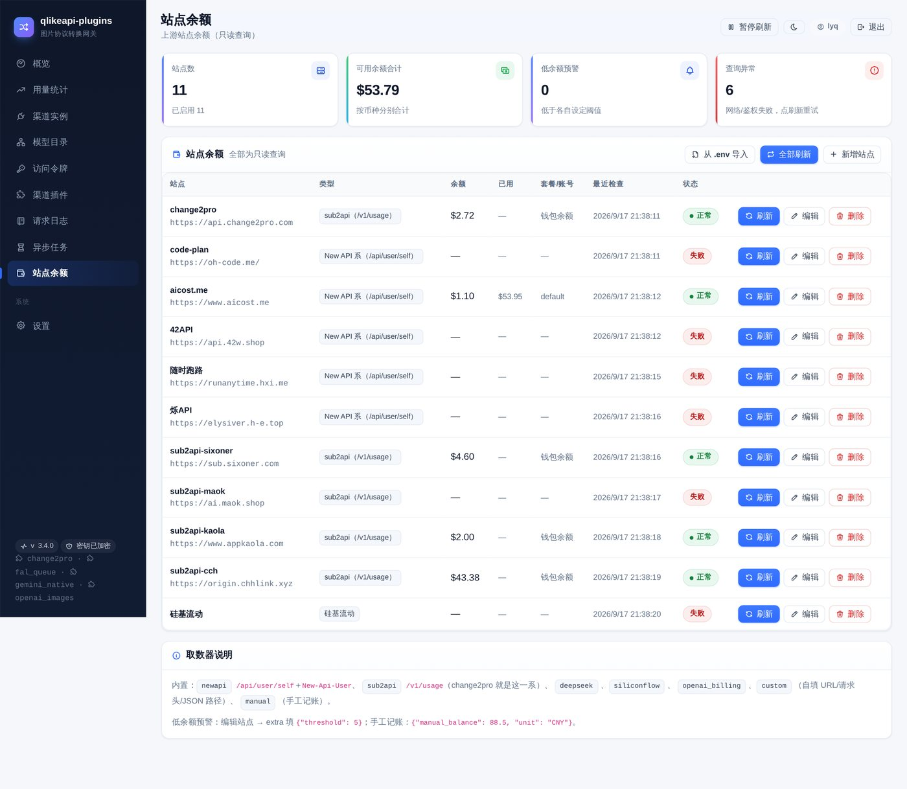
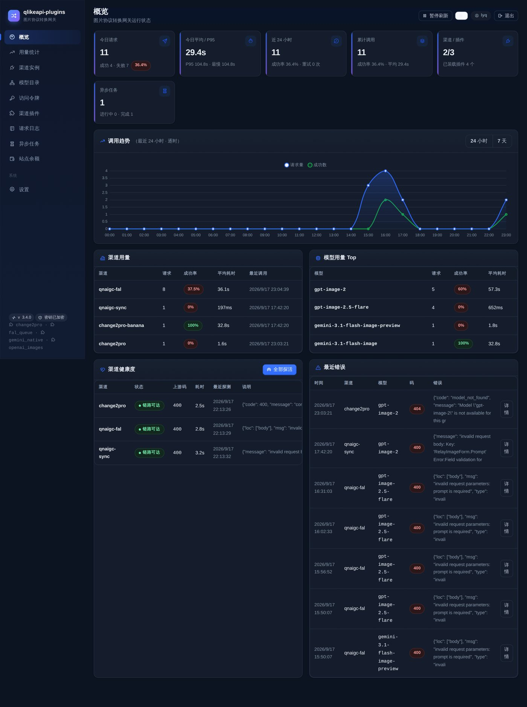
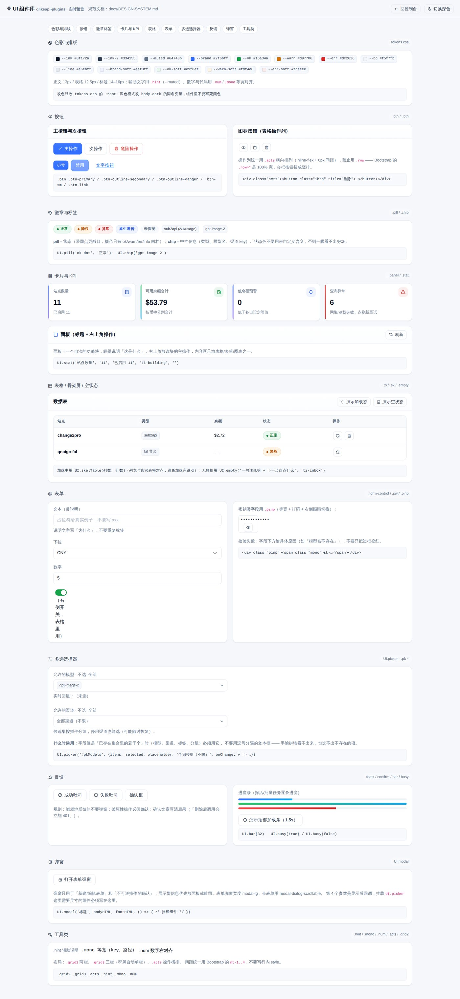

<div align="center">

# qlikeapi-plugins

**图片协议转换网关** —— 客户端只用标准 OpenAI 图片接口，剩下的交给路由层。

[](https://github.com/xiaoqi0102/qlikeapi-plugins/actions/workflows/ci.yml)
[](LICENSE)
[](https://www.python.org/)
[](Dockerfile)
[](tests/)

</div>

---

## 这是什么

一个**挂在 New API（或任何 OpenAI 兼容网关）后面的图片协议转换层**。

它解决的是同一个问题的两种表现：

1. **上游协议不统一** —— 有的中转站只认 Gemini 原生 `generateContent`，有的只认
   `POST /images/generations` 但强制返回 `b64_json`，有的必须走「异步队列 + 轮询」才给图。
   客户端（画图工具、工作流、脚本）却被要求统一成一套标准 OpenAI 图片接口。
2. **一家不稳** —— 单渠道限流、余额见底、偶发 5xx，手写重试逻辑又容易重复扣费。

本项目的做法：**客户端零改动**，请求路径变成

```
客户端  →  New API（唯一渠道）  →  qlikeapi-plugins 路由层  →  各生图上游
```

路由层负责：模型名归一化 → 按优先级/权重选链 → 协议翻译 → 失败切换 → 响应归一 → 记账。

> 图片**不落盘、不转存**，成功响应直接把上游 URL（或 base64）回给客户端。

---

## 特性

| 能力 | 说明 |
|---|---|
| **统一入口** | `POST /v1/images/generations`、`POST /v1/images/edits`，标准 OpenAI 图片形状返回 |
| **渠道插件化** | 一个上游协议 = 一个插件文件（`app/channels/*.py`），照模板复制即可加新渠道 |
| **多渠道路由** | 同一模型可挂多个渠道实例：优先级排序 + 权重分流 + 显式路由链（控制台可视化编辑） |
| **故障切换** | `429 / 402 / 5xx / 连接失败` → 换下一家；**400 参数错立即返回**（不重复打）；**超时默认不切换**（防重复扣费） |
| **自动熔断** | 连续失败到阈值自动停用；冷却到期后必须**探活通过**才放回路由（人工停用的永不被自动恢复） |
| **零成本探活** | 自检/探活**递归抹掉一切提示词字段**再打上游，用 `4xx` 判定「链路可达」——永远不会因为点一下「探活」就真出图扣费 |
| **密钥池与轮换** | 一个渠道可配多把 key（换行分隔），按轮换使用，失败自动冷却 |
| **落库加密** | 渠道密钥 / 站点令牌入库即加密（Encrypt-then-MAC，纯标准库实现），历史明文自动迁移 |
| **访问令牌** | 一把令牌 = 一个调用方：额度、过期、限模型、限渠道、IP 白名单、启停，按令牌记账 |
| **控制台** | 渠道/令牌/路由/价格/日志/用量/站点余额全套页面；深浅色主题、本地自托管前端库（离线可用） |
| **零依赖运维** | 单个容器 + 一个 SQLite 文件，不需要 Redis/Postgres |

---

## 架构

```
                     ┌──────────────────────────────────────────────┐
   画图工具/脚本      │                  New API                     │
   （客户端零改动）───►│  渠道 #30（优先级最高）= 本服务            │
                     └───────────────────┬──────────────────────────┘
                                         │  http://qlikeapi-plugins:18673/v1/images/*
                                         ▼
   ┌───────────────────────────────────────────────────────────────────────────┐
   │                        qlikeapi-plugins（本服务）                          │
   │                                                                           │
   │  ① 鉴权门    主密钥 / 访问令牌 / 控制台会话                                 │
   │  ② 归一化    模型名大小写、别名映射、multipart 附件 → 内部统一形态          │
   │  ③ 路由链    routes 表显式链 ＞ 按优先级自动链（优先级 + 权重分流）         │
   │  ④ 插件翻译  channels/<插件>.build() → (上游 URL, 上游报文, 元信息)        │
   │  ⑤ 发送      超时 / key 轮换 / 渠道冷却                                    │
   │  ⑥ 解析归一  plugins.parse() → 统一 OpenAI 图片响应 + X-QLike-* 响应头     │
   │  ⑦ 记账      请求数 / 张数 / 花费（按令牌、按渠道、按模型）                 │
   └───────┬──────────────────────────────┬──────────────────────────┬─────────┘
           ▼                              ▼                          ▼
   Gemini 原生面                     OpenAI 图片面                 异步队列面
   /v1beta/models/{m}:generateContent /v1/images/generations|edits  /queue/... → 轮询
```

细节见 [`docs/ARCHITECTURE.md`](docs/ARCHITECTURE.md)。

---

## 快速开始

```bash
git clone https://github.com/xiaoqi0102/qlikeapi-plugins.git
cd qlikeapi-plugins

cp .env.example .env
# 必须填两个随机密钥（生成方法：openssl rand -hex 24）
#   QLIKEAPI_UP_TOKEN   内部主密钥 = New API 渠道里要填的「密钥」
#   QLIKEAPI_SECRET     会话签名 + 落库加密派生源
# 再设一个控制台密码 QLIKEAPI_ADMIN_PASS

cp docker-compose.example.yml docker-compose.yml
docker compose up -d --build

curl -s localhost:18673/healthz     # {"ok":true,...}
```

浏览器打开 `http://<你的地址>:18673` → 登录控制台 → **渠道实例** 页新建渠道：

| 字段 | 填什么 |
|---|---|
| 插件 | 选对应的上游协议（如 `change2pro`、`openai_images`、`gemini_native`、`fal_queue`） |
| 上游地址 | 例如 `https://api.change2pro.com` |
| 密钥 | 上游站给你的 API key（会加密入库） |
| 模型映射 | 客户端模型名 → 上游真实模型名（如 `gpt-image-2` → `openai/gpt-image-2`） |

然后回到 **New API** 加一个渠道：

- 类型：OpenAI 兼容
- Base URL：`http://qlikeapi-plugins:18673`（同一 docker 网络内）
- 密钥：`.env` 里的 `QLIKEAPI_UP_TOKEN`
- 优先级：给到**最高**（New API 是「数字大者优先」，本服务就成了首选通道）

就完了 —— 客户端继续用原来的 OpenAI 图片接口，不用改一行代码。

> 需要 Nginx/HTTPS 反代、备份升级、回滚？见 [`docs/DEPLOYMENT.md`](docs/DEPLOYMENT.md)。

---

## 控制台

<div align="center">



*概览：KPI、用量曲线、渠道健康*


*渠道实例：优先级内联编辑、权重、批量操作、行内展开明细*


*零成本探活：逐模型显示通过/失败 + 耗时 + 上游状态码*


*访问令牌：模型/渠道权限改成下拉多选（搜索、全选、清空、已选计数）*


*站点余额：操作按钮横向一排，附取数器说明*


*深色模式*


*组件库展示页 `/ui-kit`：改 UI 前先在这里找现成组件*

</div>

---

## 目录结构

```
qlikeapi-plugins/
├── app/
│   ├── main.py                 # FastAPI 应用、版本号、/healthz
│   ├── relay.py                # 统一入口 + 鉴权 + 路由链 + 故障切换 + 探活
│   ├── protocols.py            # 协议翻译/解析（gemini / openai images / fal 队列）
│   ├── admin.py                # 控制台 API + 会话
│   ├── store.py                # SQLite 数据层（渠道/令牌/路由/价格/日志/站点）
│   ├── crypto.py               # 落库密钥加密（标准库 Encrypt-then-MAC）
│   ├── balances.py             # 站点余额取数器（插件式）
│   ├── channels/               # ★ 渠道插件目录（加新渠道只动这里）
│   ├── static/                 # 控制台前端
│   │   ├── css/                #   tokens.css（设计变量）+ ui-kit.css（组件样式）
│   │   ├── js/                 #   app.js（控制台逻辑）+ ui-kit.js（window.UI 组件库）
│   │   ├── ui-kit.html         #   组件库展示页（/ui-kit，每个组件都能真点）
│   │   └── vendor/             #   本地自托管：Bootstrap 5 / Tabler Icons / Chart.js
│   └── requirements.txt
├── tests/                      # pytest：208 个用例，零网络零成本
├── scripts/                    # 运维/验收脚本（零成本验证）
├── docs/                       # 架构、插件开发、API、配置、部署、路线图
├── .github/                    # CI、issue/PR 模板、dependabot
├── docker-compose.example.yml  # 部署样例（真实 compose 不入库）
├── .env.example                # 环境变量样例（真实密钥不入库）
├── Makefile                    # make help 看全部命令
└── pyproject.toml              # lint / 测试 / 覆盖率配置
```

---

## 常用命令

```bash
make help          # 全部命令
make install       # 建虚拟环境 + 装开发依赖
make test          # 跑测试（198 个，全离线，绝不打上游）
make lint          # ruff 静态检查
make check         # 提交前必跑：lint + test
make verify        # 零成本验收（本地 400 / dry-run / 抹 prompt 探活）
make up / down / logs / restart
make backup        # 备份 SQLite
```

---

## 写一个新渠道插件

```bash
cp app/channels/_template.py app/channels/my_relay.py
# 填 CHANNEL 元信息 + 实现 build()（把标准请求翻译成上游要的样子）
make test && make lint
# 在控制台点「重载插件」，新插件立刻可选
```

完整契约、逐字段说明与三个参考实现见 [`docs/CHANNEL-PLUGINS.md`](docs/CHANNEL-PLUGINS.md)。

---

## 开发规范

- **分支**：`main` 常绿；功能 `feat/xxx`、修复 `fix/xxx`，PR 合并前必须 `make check` 通过。
- **提交信息**：Conventional Commits（`feat:` / `fix:` / `docs:` / `refactor:` / `test:` / `chore:`）。
- **测试**：新增行为必须带测试；**任何会真打上游的测试都不许进 `tests/`**（CI 里没有任何 API key）。
- **版本**：语义化版本，改动记录进 [`CHANGELOG.md`](CHANGELOG.md)，`app/main.py` 的 `version` 与 tag 对齐。
- **UI**：控制台样式与组件一律按 [`docs/DESIGN-SYSTEM.md`](docs/DESIGN-SYSTEM.md) 来（先查组件库，别再造一套）；
  改完 CSS 跑 `make ui-diff` 做新旧样式逐元素比对，确认「合计差异: 0」。

细则（含代码风格、评审清单、发布流程）见 [`CONTRIBUTING.md`](CONTRIBUTING.md)。

---

## 安全铁律（改代码前请先读）

1. **缺提示词 → 本地 400**：绝不回落默认提示词。回落一次就是一次真出图、真扣费。
2. **探活/自检零成本**：只发「抹掉提示词」的报文，用 4xx 判定链路可达，并带硬超时。
3. **图片不落盘**：只转发上游 URL/base64，不做转存、不做磁盘缓存。
4. **密钥只进不出**：渠道密钥与站点令牌加密入库，控制台只显示掩码；日志不记密钥。
5. **明文密钥不入库、不入仓库**：`.env` / `docker-compose.yml` / `data/` 全部在 `.gitignore` 里。

漏洞报告方式见 [`SECURITY.md`](SECURITY.md)。

---

## 文档索引

| 文档 | 内容 |
|---|---|
| [docs/ARCHITECTURE.md](docs/ARCHITECTURE.md) | 分层、请求生命周期、数据模型、熔断状态机、设计取舍 |
| [docs/CHANNEL-PLUGINS.md](docs/CHANNEL-PLUGINS.md) | 渠道插件契约与开发指南（含完整示例） |
| [docs/API.md](docs/API.md) | HTTP 接口手册（统一入口 / 控制台 API / 错误码） |
| [docs/CONFIGURATION.md](docs/CONFIGURATION.md) | 全部环境变量、令牌、价格与余额取数配置 |
| [docs/DEPLOYMENT.md](docs/DEPLOYMENT.md) | Docker 部署、反代、接入 New API、备份升级回滚 |
| [docs/SMART-ROUTING-PLAN.md](docs/SMART-ROUTING-PLAN.md) | 智能路由与负载/并发控制调研（New API / Sub2API）+ 整合规划 |
| [docs/DESIGN-SYSTEM.md](docs/DESIGN-SYSTEM.md) | UI 设计规范：设计变量、组件库清单、交互约定、变更流程与坑清单 |
| [docs/ROADMAP.md](docs/ROADMAP.md) | 已做 / 计划 / **明确不做**（含理由） |
| [CHANGELOG.md](CHANGELOG.md) | 版本变更记录 |

---

## 许可

[MIT](LICENSE) © 2026 李永琪（xiaoqi0102）

第三方前端库（Bootstrap / Tabler Icons / Chart.js 等）均为本地自托管的 MIT 组件，
清单见 [`THIRD-PARTY-NOTICES.md`](THIRD-PARTY-NOTICES.md)。
